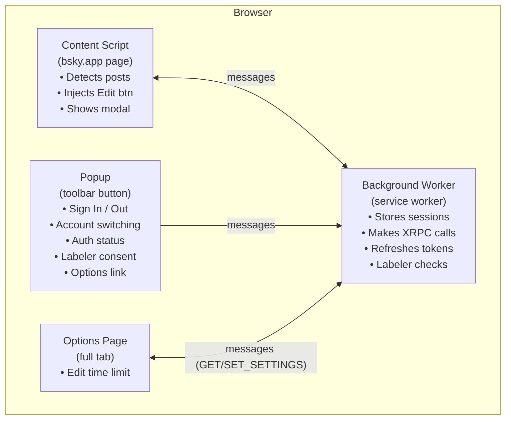
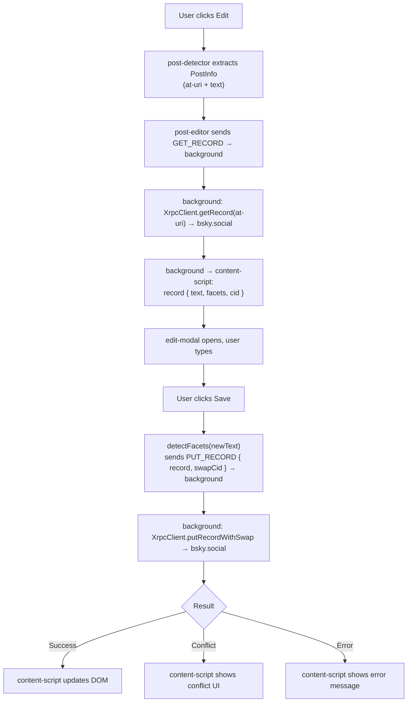
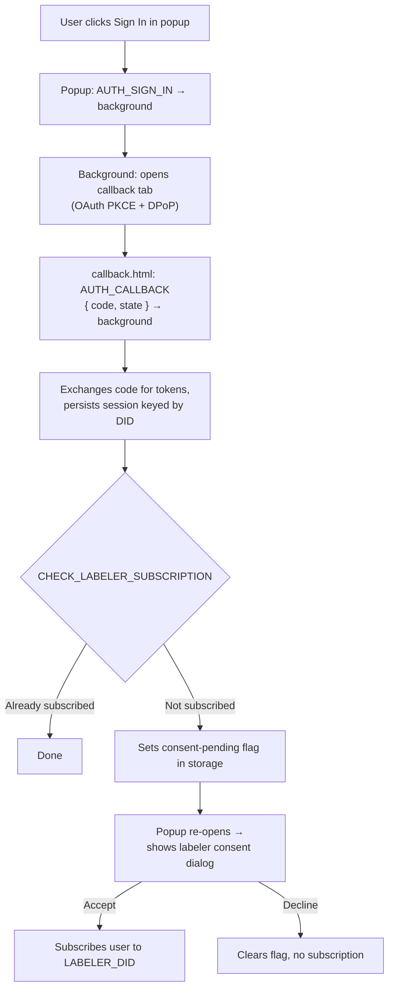

# Architecture

Skeeditor is a standard Manifest V3 browser extension built with [WXT](https://wxt.dev/). Understanding the three extension contexts and how they communicate is the key to understanding the codebase.

## The three extension contexts

### Content script (`src/entrypoints/content.ts`, `src/content/`)

Runs in the context of every `https://bsky.app/*` page. It has access to the DOM but not to extension APIs like `chrome.storage`. Responsibilities:

- **Post detection** — scans the page for posts authored by the signed-in user and injects the Edit badge. `post-detector.ts` uses a prioritised strategy: known `data-testid`/`data-at-uri` selectors first; then a fallback that walks up from `[data-testid="postText"]` leaves to the nearest ancestor with a post permalink link. This fallback covers pages like search results where bsky.app renders posts in plain `
`s with no data attributes.
- **Edit modal** — renders the in-page text editor (`<edit-modal>` Web Component) when Edit is clicked.
- **Post editor** — orchestrates fetching the record, showing the modal, and saving.
- **Edited-text cache** — `edited-post-cache.ts` holds an in-memory cache of resolved post text and a handle↔DID registry. Cached text is re-applied on every MutationObserver tick (guarded against re-entrancy) so React re-renders don't flash stale content.
- **Label push handling** — listens for `LABEL_RECEIVED` notifications from the background and immediately updates matching DOM elements so the edit is visible without a page reload.

Because the content script cannot make authenticated XRPC calls directly, it sends typed messages to the background worker for all network operations.

### Background worker (`src/entrypoints/background.ts`, `src/background/`)

Runs as a Manifest V3 service worker (Chrome) or persistent background script (Firefox). It is the trusted core of the extension. Responsibilities:

- **Session storage** — reads/writes OAuth sessions in `browser.storage.local` via `sessionStore`, keyed by DID (multi-account).
- **Token refresh** — automatically refreshes expiring tokens via `TokenRefreshManager`.
- **XRPC calls** — receives `GET_RECORD`, `CREATE_RECORD`, and `PUT_RECORD` messages from content/popup, makes the authenticated HTTP request, and returns the result.
- **OAuth flow** — handles `AUTH_SIGN_IN`, `AUTH_SIGN_OUT`, `AUTH_CALLBACK`, `AUTH_REAUTHORIZE`, `AUTH_LIST_ACCOUNTS`, `AUTH_SWITCH_ACCOUNT`, `AUTH_SIGN_OUT_ACCOUNT`.
- **Settings** — serves `GET_SETTINGS` / `SET_SETTINGS` to the options page.
- **Labeler** — after sign-in, runs `CHECK_LABELER_SUBSCRIPTION` to decide whether to show the consent dialog.

### Popup (`src/entrypoints/popup/`, `src/popup/auth-popup.ts`)

The `<auth-popup>` Web Component UI rendered when the user clicks the toolbar button. It communicates with the background worker via `browser.runtime.sendMessage` to:

- Query auth status (`AUTH_GET_STATUS`)
- List all signed-in accounts (`AUTH_LIST_ACCOUNTS`)
- Switch the active account (`AUTH_SWITCH_ACCOUNT`)
- Sign out a specific account (`AUTH_SIGN_OUT_ACCOUNT`)
- Sign in a new account (`AUTH_SIGN_IN`)
- Show a labeler consent dialog after sign-in
- Link to the options page

### Options page (`src/entrypoints/options/`)

A full-tab settings page accessible from the popup. Currently manages:

- **Edit time limit** — the window after a post is created during which the Edit button is visible (0.5–5 minutes, or unlimited).

Settings are persisted in `browser.storage.local` under `"settings"` via the `GET_SETTINGS` / `SET_SETTINGS` messages.

---

## Data flow: editing a post

## Data flow: sign-in and labeler check

---

## Key design decisions

### Background-centric authentication

All token access lives in the background worker, never in the content script. This ensures tokens cannot be exfiltrated by a malicious page via XSS or prototype pollution in the bsky.app context.

### Multi-account sessions

Sessions are stored as a map keyed by DID in `browser.storage.local`. The active account is tracked separately under `"activeDid"`. This lets users sign in with multiple Bluesky accounts and switch between them without signing out.

### Typed messages

All inter-context communication uses the typed `MessageRequest` union defined in `src/shared/messages.ts`. Each message type has a corresponding `ResponseFor<T>` type so TypeScript enforces the call/response contract at compile time.

### Debug logging

Debug output is controlled by `src/shared/logger.ts`. A module-level flag is evaluated once at import time; all `log.debug()` calls compile to a no-op when debug mode is off. To enable:

- `localStorage.setItem('skeeditor:debug', '1')` in the bsky.app console
- Append `?skeeditor_debug=1` to any bsky.app URL
- Set `<html data-skeeditor-debug="1">` in the page DOM

When enabled, rapid bursts of events (e.g. MutationObserver scans) are batched into a 150 ms window and printed as a single collapsed `console.groupCollapsed` entry.

### Platform shims

Browser API differences are isolated in `src/platform/<browser>/`. Shared code always uses the `wxt/browser` re-export of `webextension-polyfill` (`browser.*` Promise API).

### Optimistic concurrency via CID

`putRecord` passes the CID from the fetched record as a `swapCid`. The PDS rejects writes where the record has changed, preventing silent overwrites. The extension surfaces the conflict to the user rather than silently discarding either version.

### Labeler subscription is opt-in

The consent dialog after sign-in is informational — subscribing to the Skeeditor labeler is never automatic. Users who decline will simply not see "edited" labels on posts.
