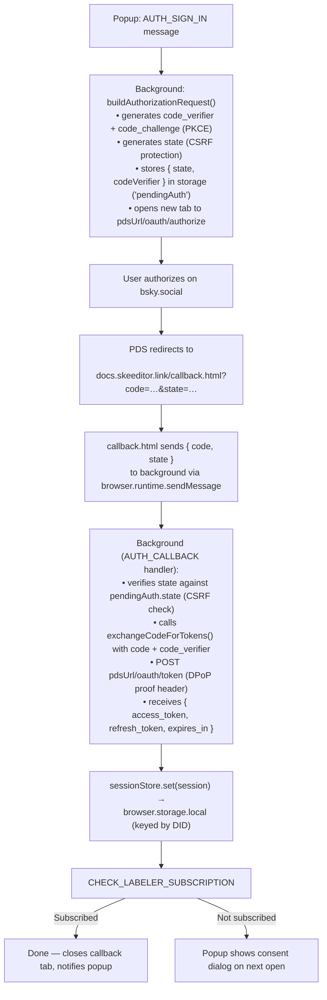

# Authentication

Skeeditor authenticates with the Bluesky PDS (Personal Data Server) via OAuth 2.0 with PKCE (Proof Key for Code Exchange) and DPoP (Demonstrating Proof of Possession). All auth flow logic lives in the background service worker.

## Key principle

Content scripts and the popup **never handle tokens directly**. They send typed messages to the background worker, which manages all token access, refresh, and revocation.

---

## OAuth 2.0 + PKCE flow



---

## DPoP (Demonstrating Proof of Possession)

The Bluesky PDS requires `dpop_bound_access_tokens: true`. Every token request and token refresh includes a DPoP proof header:

- A per-request signed JWT created with an ephemeral private key.
- The DPoP private key is generated at sign-in time and retained for the life of the session.
- DPoP binds access tokens to the private key — a stolen token cannot be used without the key.

DPoP key generation and proof-header signing are implemented in `src/shared/auth/auth-client.ts`.

---

## PKCE utilities (`src/shared/auth/pkce.ts`)

```ts
import {
  generateCodeVerifier,
  deriveCodeChallenge,
  generateState,
} from "@src/shared/auth/pkce";

const codeVerifier = generateCodeVerifier(); // 43-128 char random string
const codeChallenge = await deriveCodeChallenge(codeVerifier); // SHA-256, base64url-encoded
const state = generateState(); // 32-char random string for CSRF check
```

Prefer the higher-level `buildAuthorizationRequest()` from `auth-client.ts` which combines all steps and stores the verifier/state for later retrieval.

---

## OAuth client registration

AT Protocol requires the client to be identified by a **client ID that is a valid HTTPS URL** pointing to a publicly accessible client metadata document. The metadata document specifies the redirect URIs, scopes, and other client parameters.

```json
{
  "client_id": "https://docs.skeeditor.link/oauth/client-metadata.json",
  "client_name": "skeeditor",
  "client_uri": "https://docs.skeeditor.link",
  "redirect_uris": ["https://docs.skeeditor.link/callback.html"],
  "response_types": ["code"],
  "grant_types": ["authorization_code", "refresh_token"],
  "token_endpoint_auth_method": "none",
  "scope": "atproto transition:generic",
  "dpop_bound_access_tokens": true
}
```

The `client_id` is `BSKY_OAUTH_CLIENT_ID` and the redirect URI is `BSKY_OAUTH_REDIRECT_URI`, both exported from `src/shared/constants.ts`. Using a stable hosted redirect URI avoids dealing with per-browser, per-install extension IDs in the OAuth flow.

---

## Session store (`src/shared/auth/session-store.ts`)

The session store persists OAuth sessions in `browser.storage.local` under the key `"sessions"`, keyed by DID. This enables multiple Bluesky accounts to be signed in simultaneously.

```ts
// Internal API — called only from the background service worker

// Persist a session (marks DID as active)
await sessionStore.set(session);

// Read the active account's session
const session = await sessionStore.get();

// Read a specific account's session by DID
const session = await sessionStore.getByDid(did);

// List all signed-in accounts (returns public metadata only, no tokens)
const accounts = await sessionStore.listAll();

// Get / set the active DID
const did = await sessionStore.getActiveDid();
await sessionStore.setActiveDid(did);

// Sign out a specific account
await sessionStore.clearForDid(did);

// Sign out all accounts
await sessionStore.clear();

// Migrate a legacy single-account session to the new multi-account storage
await sessionStore.migrateFromLegacy();
```

Storage layout in `browser.storage.local`:

```json
{
  "sessions": {
    "did:plc:alice": { "accessToken": "...", "refreshToken": "...", "expiresAt": 1234567890, "did": "did:plc:alice", "handle": "alice.bsky.social", "scope": "atproto transition:generic" },
    "did:plc:bob":   { ... }
  },
  "activeDid": "did:plc:alice",
  "pdsUrls": {
    "did:plc:alice": "https://bsky.social",
    "did:plc:bob": "https://alice.pds.example"
  }
}
```

---

## Multi-account messages

The popup queries and switches accounts via the message layer — it never reads storage directly.

| Message | Payload | Description |
| --- | --- | --- |
| `AUTH_LIST_ACCOUNTS` | — | Returns all signed-in accounts |
| `AUTH_SWITCH_ACCOUNT` | `did` | Makes a different account active |
| `AUTH_SIGN_OUT_ACCOUNT` | `did` | Signs out one account without affecting others |
| `AUTH_GET_STATUS` | — | Returns auth status for the active account |

---

## Token refresh (`src/shared/auth/token-refresh.ts`)

`TokenRefreshManager` proactively refreshes the access token before it expires:

- Deduplicates concurrent refresh requests (only one in-flight at a time).
- Retries on transient network errors.
- Calls `sessionStore.set()` with the new tokens after a successful refresh.
- Emits an `auth-session-invalidated` event on unrecoverable failures (e.g. refresh token revoked), which triggers a re-auth prompt in the popup.

---

## Required scopes

| Scope | Purpose |
| --- | --- |
| `atproto` | Identifies this as an AT Protocol client |
| `transition:generic` | Grants read/write access to records the user owns |

---

## OAuth endpoints

The extension discovers OAuth endpoints dynamically from the PDS's well-known document. The default PDS is `https://bsky.social`.

| Endpoint | URL pattern |
| --- | --- |
| Discovery | `<pdsUrl>/.well-known/oauth-authorization-server` |
| Authorization | `<pdsUrl>/oauth/authorize` |
| Token | `<pdsUrl>/oauth/token` |

Helper functions `getOAuthAuthorizeUrl(pdsUrl)` and `getOAuthTokenUrl(pdsUrl)` in `src/shared/constants.ts` construct these URLs.

---

## Security notes

- **Never expose tokens to content scripts.** Content scripts run in the page context and can be observed by bsky.app's JavaScript. All token access goes through background messages.
- **Always verify `state`** in the OAuth callback. A mismatch means a CSRF attempt — the handler returns an error immediately.
- **No client secret.** Public browser extension clients use `token_endpoint_auth_method: "none"`. PKCE replaces the client secret.
- **DPoP** binds access tokens to an ephemeral private key, limiting the impact of token theft.
- **Pending auth state** (PKCE verifier + state) is stored ephemerally in `browser.storage.local` under `"pendingAuth"` and removed immediately after the code exchange completes.
