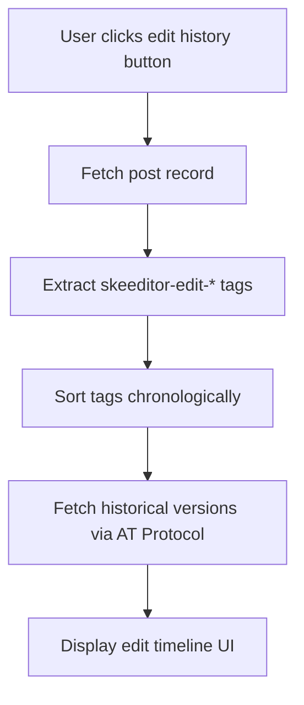

# Edit History Implementation

## Overview

The Skeeditor extension now tracks edit history by storing content fingerprints in the post's `tags` field. This enables future implementation of an edit history modal that can show the evolution of a post to users who have the extension installed.

## Implementation Details

### 1. Content Fingerprinting

Each time a post is edited, we generate a deterministic hash of the previous content and store it as a tag:

```typescript
// Simple hash function for creating content fingerprints
function simpleHash(text: string): string {
  let hash = 0;
  for (let i = 0; i < text.length; i++) {
    const char = text.charCodeAt(i);
    hash = (hash << 5) - hash + char;
    hash = hash & hash; // Convert to 32bit integer
  }
  return `edit-${Math.abs(hash).toString(16).substring(0, 8)}`;
}
```

### 2. Tag Structure

Edit history tags follow this format:

- **Prefix**: `skeeditor-edit-`
- **Hash**: 8-character hexadecimal hash of the previous content
- **Example**: `skeeditor-edit-a1b2c3d4`

### 3. Data Storage

Tags are stored in the post's `tags` array field, which is part of the AT Protocol post record specification. This ensures:

- **Compatibility**: Works with the existing Bluesky data model
- **Persistence**: Edit history survives post updates
- **Discoverability**: Other clients can access the edit history

### 4. Tag Management

The implementation:

- Preserves existing tags when adding edit history
- Adds one new tag per edit operation
- Maintains deterministic hashing (same content = same hash)
- Respects the 8-tag limit imposed by Bluesky

## Future Features

### Edit History Modal

The stored tags enable these future features:

1. **Edit Timeline**: Show the sequence of edits with timestamps
2. **Content Diff**: Compare different versions of the post
3. **Edit Statistics**: Track how often posts are edited
4. **Collaborative Editing**: Detect when multiple users edit the same post

### Implementation Plan for Edit History Modal



## Technical Considerations

### 1. Hash Collision Handling

The current simple hash function may have collisions. For production use, consider:

- Using a cryptographic hash function (SHA-256 truncated)
- Adding salt to prevent intentional collisions
- Implementing collision detection

### 2. Tag Limit Management

Bluesky limits posts to 8 tags. Our implementation:

- Currently adds tags indefinitely
- Future enhancement: Implement tag rotation when limit is reached
- Consideration: Prioritize keeping most recent edit history

### 3. Privacy Considerations

Edit history tags:

- Are public (visible to anyone who can see the post)
- Don't contain the actual previous content (only hashes)
- Enable reconstruction of edit history only for extension users

### 4. Performance

- Hash computation is O(n) where n is content length
- Tag storage adds minimal overhead (~10 bytes per edit)
- No impact on post rendering performance

## Example Usage

### Single Edit

```json
{
  "tags": ["skeeditor-edit-a1b2c3d4"],
  "labels": {
    "values": [{ "val": "edited" }]
  }
}
```

### Multiple Edits

```json
{
  "tags": ["skeeditor-edit-a1b2c3d4", "skeeditor-edit-5e6f7g8h", "skeeditor-edit-9i0j1k2l"],
  "labels": {
    "values": [{ "val": "edited" }]
  }
}
```

## Testing

The implementation includes comprehensive tests covering:

- Basic edit history tag creation
- Tag format validation
- Preservation of existing tags
- Deterministic hashing behavior
- Label integration

## Migration Path

### Current Implementation

- ✅ Basic edit tracking with labels
- ✅ Content fingerprinting in tags
- ✅ Tag preservation and management

### Future Enhancements

- [ ] Edit history modal UI
- [ ] Content diff visualization
- [ ] Tag rotation for limit management
- [ ] Cryptographic hashing
- [ ] Edit history analytics

## API Compatibility

The implementation uses only standard AT Protocol fields:

- `tags`: Standard post field for metadata
- `labels`: Standard field for content warnings/moderation
- No custom fields or extensions required

This ensures maximum compatibility with Bluesky clients and the broader AT Protocol ecosystem.
