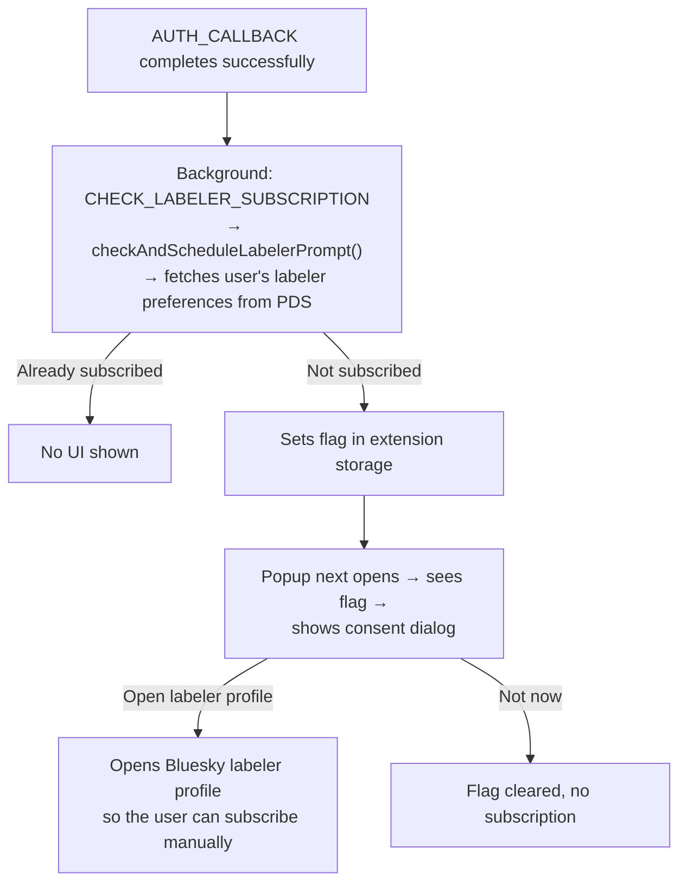

# Labeler Services

Skeeditor operates its own AT Protocol labeler service that applies an **"edited"** label to posts the user has edited through the extension. This lets other users see at a glance that a post has been modified.

---

## Overview

After a user edits a post, Skeeditor writes the updated record to their PDS and simultaneously has the labeler service apply an `edited` label to that AT-URI. Users who have subscribed to the Skeeditor labeler will see a badge on edited posts in the Bluesky app.

---

## Labeler account

| Property    | Value                              |
| ----------- | ---------------------------------- |
| Handle      | `@skeeditor.link`                  |
| DID         | `did:plc:m6h36r2hzbnozuhxj4obhkyb` |
| Deployed at | `https://labeler.skeeditor.link`   |

The DID is exported from `src/shared/constants.ts` as `LABELER_DID`.

::: info Production defaults vs. local overrides
The DID, handle, service URL, and fallback public key shown in this document are the current production values. The Worker reads them from `packages/labeler/wrangler.jsonc` (`LABELER_DID`, `LABELER_HANDLE`, `LABELER_SERVICE_URL`, and `LABELER_PUBLIC_KEY_MULTIBASE`) and can be pointed at other environments for dev/test deployments.
:::

---

## Cloudflare Worker (`packages/labeler/`)

The labeler service runs as a [Cloudflare Worker](https://workers.cloudflare.com/), deployed via [Wrangler](https://developers.cloudflare.com/workers/wrangler/). The source lives in `packages/labeler/src/`.

### Key files

| File                  | Purpose                                                     |
| --------------------- | ----------------------------------------------------------- |
| `src/index.ts`        | Worker entry point — handles incoming HTTP requests         |
| `src/auth.ts`         | DID authentication and request verification                 |
| `src/hub.ts`          | `BroadcastHub` Durable Object — tracks active subscriptions |
| `src/label.ts`        | Label creation and signing                                  |
| `src/did-document.ts` | DID document resolution                                     |
| `src/types.ts`        | Shared TypeScript types                                     |

### Bindings (wrangler.jsonc)

| Binding         | Kind           | Purpose                            |
| --------------- | -------------- | ---------------------------------- |
| `LABELS_KV`     | KV Namespace   | Stores signed label records        |
| `BROADCAST_HUB` | Durable Object | Manages WebSocket listener fan-out |

### Environment variables

| Variable                       | Production value                    |
| ------------------------------ | ----------------------------------- |
| `LABELER_DID`                  | `did:plc:m6h36r2hzbnozuhxj4obhkyb`  |
| `LABELER_HANDLE`               | `skeeditor.link`                    |
| `LABELER_SERVICE_URL`          | `https://labeler.skeeditor.link`    |
| `LABELER_PUBLIC_KEY_MULTIBASE` | published fallback verification key |

`LABELER_SIGNING_KEY` is stored as a Worker secret. When it is present, the DID document derives the public key directly from the signing key at runtime; otherwise the Worker falls back to `LABELER_PUBLIC_KEY_MULTIBASE`. If neither is configured, `/.well-known/did.json` fails fast with a 500 so a mismatched or incomplete deployment is obvious.

---

## Labeler subscription flow

Subscribing to the labeler is optional. On first sign-in, the extension checks whether the user has already subscribed and shows a **consent dialog** in the popup if they have not.



The `CHECK_LABELER_SUBSCRIPTION` message is fire-and-forget from the perspective of the popup. A network error during the check is silently swallowed — it must never block or delay the sign-in flow. The popup prompt is **manual**: it opens the Bluesky labeler profile and leaves subscription management to Bluesky.

Separately, the extension background service currently opens the labeler WebSocket on startup as a best-effort real-time enhancement. This does **not** subscribe the user in Bluesky by itself; it only lets installed Skeeditor clients hear `edited` label broadcasts quickly.

---

## Label structure

Labels applied by the Skeeditor labeler follow the AT Protocol label specification:

```ts
{
  src: "did:plc:m6h36r2hzbnozuhxj4obhkyb",  // labeler DID
  uri: "at://did:plc:alice/app.bsky.feed.post/3jxyz",  // labeled post
  cid: "<post-cid>",         // CID of the version being labeled
  val: "edited",             // label value
  cts: "2025-01-01T00:00:00.000Z",  // creation timestamp
}
```

---

## Deploying the labeler worker

```sh
cd packages/labeler

# Create KV namespaces (first time only)
wrangler kv namespace create LABELS_KV
wrangler kv namespace create LABELS_KV --preview
# → copy the returned IDs into wrangler.jsonc

# Deploy
wrangler deploy
```

The custom domain `labeler.skeeditor.link` is configured as a route in `wrangler.jsonc` and must be set up in the Cloudflare dashboard.

If you rotate `LABELER_SIGNING_KEY`, update `LABELER_PUBLIC_KEY_MULTIBASE` only if you intentionally rely on the fallback path. In normal production deployments, the runtime-derived key from `LABELER_SIGNING_KEY` should be the source of truth.

### DPoP / CORS rollout checklist

The Worker source allows the `DPoP` header in CORS preflight and forwards it through `tools.skeeditor.emitLabel`, but that only helps once the deployed Worker is updated.

Before re-enabling DPoP-based labeler emits in the extension:

1. Deploy the current `packages/labeler` Worker.
2. Confirm preflight advertises `DPoP` in `Access-Control-Allow-Headers` for `POST /xrpc/tools.skeeditor.emitLabel`.
3. Confirm the Worker still accepts Bearer requests so older clients remain compatible during rollout.
4. Only then switch the extension emit path from Bearer-compat mode back to DPoP.

Quick manual verification after deploy:

```sh
cd packages/labeler
wrangler deploy

curl -i -X OPTIONS https://labeler.skeeditor.link/xrpc/tools.skeeditor.emitLabel \
  -H 'Origin: chrome-extension://test-extension' \
  -H 'Access-Control-Request-Method: POST' \
  -H 'Access-Control-Request-Headers: authorization, content-type, dpop'
```

The response should include `Access-Control-Allow-Headers` containing `DPoP`.

---

## Resources

- [AT Protocol label specification](https://atproto.com/specs/label)
- [Bluesky moderation documentation](https://docs.bsky.app/docs/advanced-guides/moderation)
- [Cloudflare Workers documentation](https://developers.cloudflare.com/workers/)
